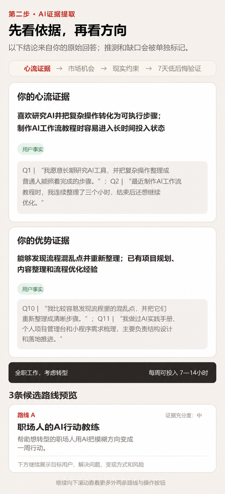

# OPC定位神器（MVP Demo）

一个帮助用户从个人经历与现实约束出发，找到当前最值得尝试方向的微信小程序 MVP。用户完成 20 个问题后，系统结合个人证据、市场机会和现实约束，生成 3 条候选路线、1 条优先路线与 7 天最小行动计划。

> 当前为黑客松评审与产品演示公开仓库。分析结果用于方向验证参考，不构成职业、投资或人生决策依据。

## 评委体验说明
- 产品通过微信小程序体验二维码访问，不提供普通网页产品版本。
- 评委需先被添加为小程序体验成员，再使用微信扫描主办方收到的最新体验二维码。
- 体验二维码有有效期；如二维码失效，请联系项目提交者获取最新版。
- 也可以通过下载下面的操作视频了解产品情况

## 操作视频

[▶ 在线播放完整操作视频（4分39秒，无声）](https://jasmine20260110.github.io/opc-positioning-miniapp/demo/)

若播放页暂时无法打开，可[直接下载 MP4 视频](https://raw.githubusercontent.com/jasmine20260110/opc-positioning-miniapp/master/demo/opc-demo.mp4)。视频使用虚构演示数据，已移除音轨、录屏通知和原始设备描述元数据。

## 演示截图

### 首页


### 三条候选路线过渡页


### 证据与候选路线示例



截图中的回答、数字和路线均为虚构演示内容，不代表真实用户信息或实际运营数据。更精简的产品说明见 [公开版功能说明](docs/公开版功能说明.md)。


## MVP 流程

1. 首页点击“开启定位”进入定位封面，再点击“进入我的人生花园”进入问题 1；或使用示例数据快速演示；
2. 完成 20 个问题；
3. 云函数调用阿里百炼 `deepseek-v4-flash`；
4. 查看证据、3 条候选路线和市场机会；
5. 查看启动适配结论并选择路线；
6. 生成 7 天行动计划；
7. 点击“开始 Day 1”，在本机记录当前计划状态。

AI 输出会经过 JSON 解析和 Schema 校验。AI 调用失败时，前端允许重试，并为 7 天计划提供固定模板降级。

## 技术结构

```text
miniprogram/              微信小程序端
  pages/                  首页、问答、分析、报告、计划页面
  utils/                  数据契约、本地状态、规则和降级计划
cloudfunctions/opcApi/    AI 云函数、提示词、校验器和单元测试
scripts/                  本地、云端及开发者工具回归脚本
docs/                     数据契约、配置说明和阶段验收记录
demo/                     公开操作视频与播放页面
assets/                   公开演示截图
```


## 数据与隐私

- 用户答案会经微信云函数发送到阿里百炼进行分析；
- 云函数不主动记录完整答案或模型原文；
- 问答进度、分析结果、反馈和计划保存在小程序本机，不写入云数据库；
- 内部测试不要输入身份证号、客户名单、公司机密等敏感内容；
- `.env`、`.env.*` 和 `project.private.config.json` 默认被 Git 忽略；
- `.env.example` 只保存变量名和占位符。

## 当前限制

- 仅完成 P0 MVP，没有登录、跨设备同步、云端历史记录和运营后台；
- Day 1 只记录本地开始状态，完整执行和提醒功能尚未实现；
- AI 结果用于方向验证参考，不能替代用户自己的判断。

## 权利声明

Copyright © 2026 OPC定位神器项目作者。All rights reserved.

本仓库公开用于项目评审和展示，但未附带开源许可证，不代表授予复制、修改、分发或商业使用权。如需引用或合作，请事先联系项目作者。
